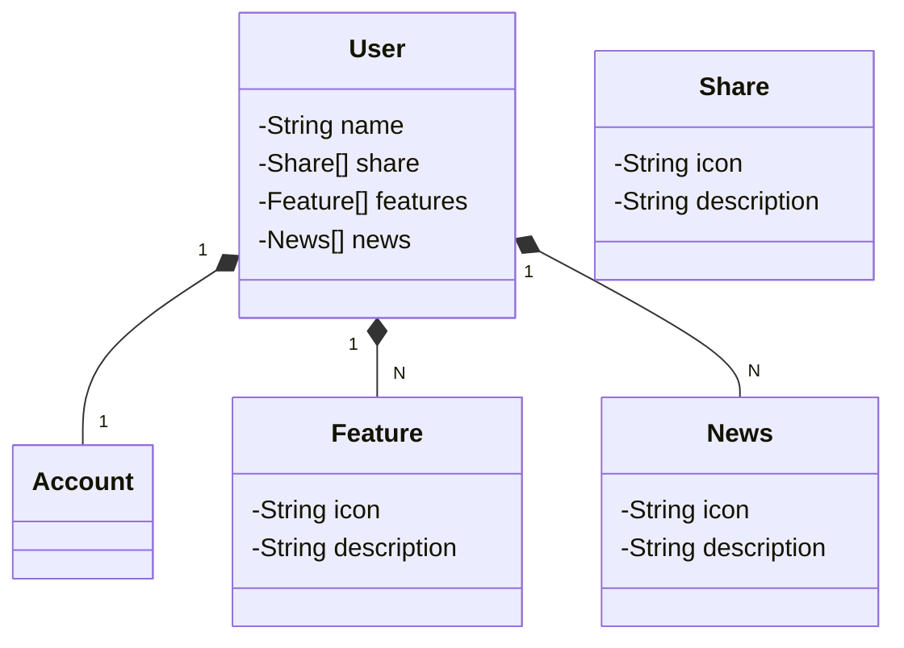

## Siba mais sobre o projeto
O objetivo é realizar a integracao para uma pagina de wish list de livros de uma biblioteca online

## Diagrama de Classes (Domínio da API)

```mermaid
classDiagram
  class User {
    -String name
    -Share[] share
    -Feature[] features
    -News[] news
  }

  class Share {
    -String icon
    -String description
  }

  class Feature {
    -String icon
    -String description
  }

  class News {
    -String icon
    -String description
  }

  User "1" *-- "1" Account
  User "1" *-- "N" Feature
  User "1" *-- "N" News
```
